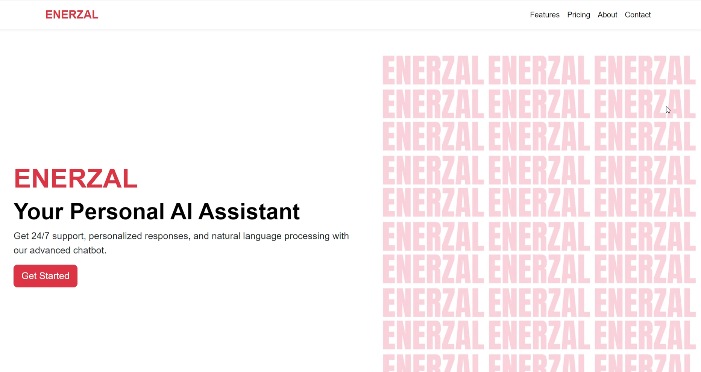

  
<h1 style="font-size: 1.8rem; font-weight: bold; color: #000;">Tech Enerzal  Enterprise Assistant - AI Chatbot Solution</h1>

## Problem Statement

Large organizations, such as **Intel** (with 130,000+ employees) and **Walmart** (with over 2.1 million employees), often experience significant strain on their HR and IT support personnel. Managing a vast workforce results in a flood of repetitive employee queries related to HR policies, IT support, company events, and more. These queries not only consume valuable time but also slow down overall productivity. Traditional support systems are becoming inefficient, especially when dealing with such large employee bases, and personalized responses for every employee become an overwhelming challenge. This puts immense pressure on HR and IT departments, resulting in long wait times and decreased employee satisfaction.

## Our Solution

**Tech Enerzal Enterprise Assistant** offers a scalable and customizable organizational chatbot solution designed to streamline and automate HR, IT support, and company event-related queries. By leveraging advanced AI technologies, this solution can automatically respond to a wide array of questions in real-time, significantly reducing the strain on support personnel. Our chatbot is built with the flexibility to be tailored to any organization's specific needs, enabling companies to add or remove features in the RAG (Retrieval-Augmented Generation) pipeline based on their requirements. With a focus on security, privacy, and seamless integration, **Tech Enerzal** provides an affordable, scalable solution that helps organizations of any size, from startups to global enterprises, effectively handle employee queries without compromising on efficiency or data protection.

## Technical Implementation

On the technical front, **Tech Enerzal** integrates **NLP (Natural Language Processing)** and **RAG** to provide real-time responses to employee queries. The solution supports personalized interactions through **employee dashboard integration**, which retrieves relevant data for each employee’s query dynamically using **real-time function calls**. The chatbot is further enhanced by a **graph-based RAG pipeline**, continuously updated via automated scraping of internal documents, websites, and social profiles. Additionally, we offer document processing features where employees can upload documents (PDF, DOCX) for secure summarization, and access is managed through the **employee login system**. For security, we use open-source technologies without relying on third-party APIs, and **2FA (TOTP)** is implemented for secure logins. The solution can be deployed on **local infrastructure** for high-security use cases or **cloud computing** for lower-security applications, with response times of 4-8 seconds.

## Key Features

- **Employee Dashboard Integration**: Provides personalized responses by fetching relevant employee data dynamically.
- **RAG Database for Static Company Information**: Keeps company details up to date through automated internal document scraping and integration with external sources (websites, social profiles).
- **Graph-Based RAG Integration**: Enhances query handling with relationship-based data retrieval for employees, departments, and company policies.
- **Document Processing and Query Response**: Employees can upload documents for summarization and receive secure responses based on document content.
- **Access Management and Secure Login**: Integrated employee login and access management for secure document handling.
- **Security and Privacy Focused**: Built using an open-source tech stack, offering local infrastructure deployment for sensitive use cases and cloud-based options for scalable needs.
- **2FA (TOTP) Implementation**: Ensures secure logins and access management.
- **Cost-Effective and Customizable**: Fully customizable RAG pipeline and seamless integration, allowing companies to tailor the solution to their unique needs.

---

## Additional Resources

- **KPR Intel-GenAI** [PPT](https://www.canva.com/design/DAGSrRRaONI/oGPi8U2z5Nu3KRh8-Nt-mg/edit?utm_content=DAGSrRRaONI&utm_campaign=designshare&utm_medium=link2&utm_source=sharebutton)
- **Flowchart**: [View Flowchart](https://lucid.app/lucidchart/29c36844-c506-464a-9385-001027ab9bba/edit?invitationId=inv_99934db6-f262-402c-a471-1f6ab6beda84&page=0_0#)
- **UIX**: [View UIX](https://www.figma.com/design/JjWcawrtYeyI9HQGt4eqwu/KPR-Chat_-Bot?node-id=0-1&t=finadrfppcxr3dh9-1)

---

